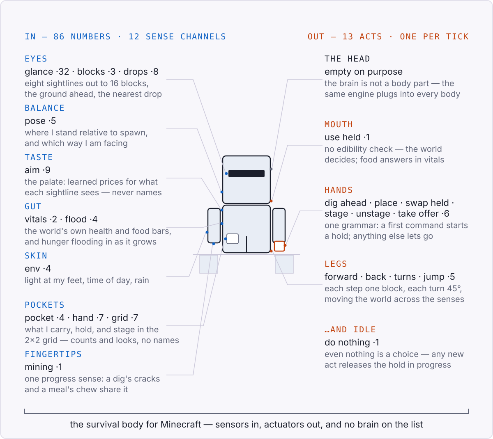
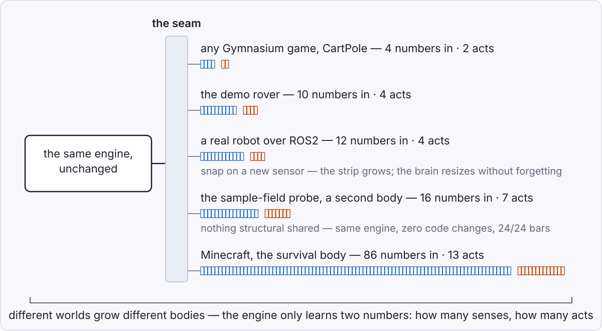
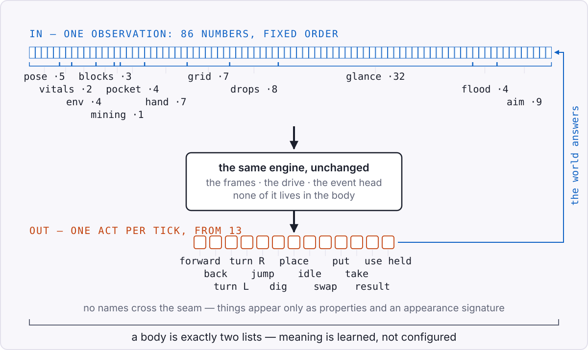

<!-- Draws on: designs 0002 (anatomy, I/O, and the bus), 0012 (anatomy from
     the world), 0016 (the motivation stack); specs 027 (minecraft body) and
     044 (survival default); the adapter contract
     specs/027-minecraft-body/contracts/minecraft-adapter.md. Channel table
     verified by running c1_anatomy(): 86 numbers, 13 acts (2026-08-16). -->

# Appendix — The anatomy of a body

The chapters tell the story; this page is the reference card I check
them against. Every chapter that mentions a sensor, an act, or "the
body" is pointing at the picture drawn here. It answers three
questions, in the order they come up: what is a world, what does a
body in that world look like, and how does the brain talk to it.

## What is a world?

A world is anything the brain can poke and watch. Three things make
something a world and not just a scene rolling past: it can be sensed
as it changes; it can be acted on, so that acting changes what is
sensed next; and the reply comes back soon enough to learn from. A
lawn, a game, a robot's room, a market feed — the mechanism doesn't
care, and that indifference is the whole design.

## What does a body in that world look like?

The body is the only part of the system that touches the world, and
it is smaller than the word suggests: a body is exactly two lists. A
list of sensors, read in a fixed order into one observation. A list
of acts it can perform, one per tick. That is the entire definition —
everything else in this book lives behind that pair of lists.

Here is the body the bot wears in Minecraft today, grouped the way a
doctor would group it:

Two things in that picture carry the whole idea. First, the head is
empty on purpose. The brain — the frames, the drive, the event head —
is not a body part. It plugs in at the seam, and it is the same
engine whatever body it wears. Second, some organs are missing. This
body has no ears, because sound is not one of its channels. A part of
the world a body cannot sense does not exist for that body — which is
why designing an anatomy is really deciding what its world *is*.

The mouth shows how far the no-meaning rule goes. There is no
edibility check inside it: "eat" is just *use what you hold*, and
what that does is the world's to decide. Nourishment reaches the
brain the only way anything does — as the next observation. Taste is
not wired in either: the palate is a little price book the body
learns from its own meals, shown to the brain only as *worth*, never
as names.

One caution about a word. The channel called `pose` here is the
body's position-and-heading sense. The *pose* the architecture is
named after — where a frame's knobs point for the current
observation — is a different thing that happens to share the
name.[^pose-ch]

Ask for another world and you get another body:

The run chapter 13 tells happened in an earlier, smaller version of
the Minecraft body — 32 numbers and twelve acts. Bodies grow; new
senses are appended, never reordered, so everything already learned
keeps its place. This appendix always describes the current default.

## How does the brain talk to the body?

Organ words are for us. The brain sees none of them. One observation
is 86 numbers in a fixed order; one act is an index between 0 and 12.
No names cross the seam, and no item classes: a thing appears only as
properties the world itself asserts — placeable, edible, a count —
and a three-number appearance signature. Categories are the brain's
to form.

There is no reward wire in this picture, and no success flag coming
back from the acts. The only feedback the brain ever receives is the
next observation — the same rule the triplet was built on in
chapter 4. That is why one engine can run every body in this book: it
never needs to know what a number means, only that the ordering is
stable and that acting changes what arrives next.

> **Under the hood: the current default body, exactly.** Verified by
> running the body's own declaration (`c1_anatomy()`), not copied
> from prose. Observation width 86, twelve channels, in declared
> order:
>
> | channel | slice | what it reads |
> |---|---|---|
> | `pose` | 0–4 | x, z, y relative to spawn; sin/cos of yaw |
> | `vitals` | 5–6 | health/20, food/20 — the game's own bars |
> | `env` | 7–10 | block light; sin/cos of time of day; rain |
> | `blocks` | 11–13 | solid ahead at feet and at eye level; drop ahead |
> | `mining` | 14 | held-intention progress: a dig's cracks or a meal's chew |
> | `pocket` | 15–18 | totals only, capped at 64: total, kinds, placeable, other |
> | `hand` | 19–25 | present, placeable, edible, count, 3-number signature |
> | `grid` | 26–32 | staged count; the grid's offer and its signature |
> | `drops` | 33–40 | nearest ground item: bearing, distance, count, signature |
> | `glance` | 41–72 | eight 45° sectors: feet-level distance to 16 blocks + signature |
> | `flood` | 73–76 | hunger deficit, expanded; silent above 15/20 food |
> | `aim` | 77–85 | the palate's relative prices per sector, plus the sensed drop |
>
> Thirteen acts: forward, back, turn left, turn right, jump forward,
> dig ahead, place ahead, idle, swap held, grid put, grid take, take
> result, use held. Turns are exactly 45°. `dig ahead` and `use held`
> are held intentions with one grammar: a first command begins,
> repeats continue, any other command releases. The appearance
> signature is three bytes of `sha256(item_name)` scaled to [−1, 1] —
> stable, distinguishing, semantics-free.

[^pose-ch]: Chapter 6, and the glossary.
