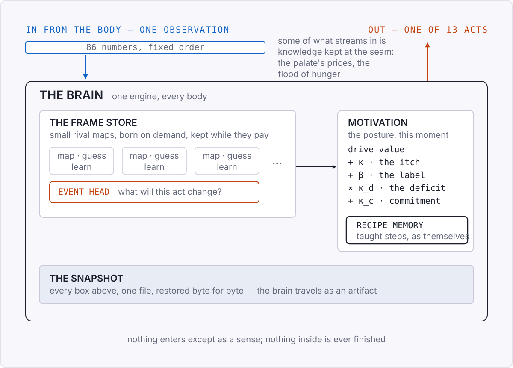
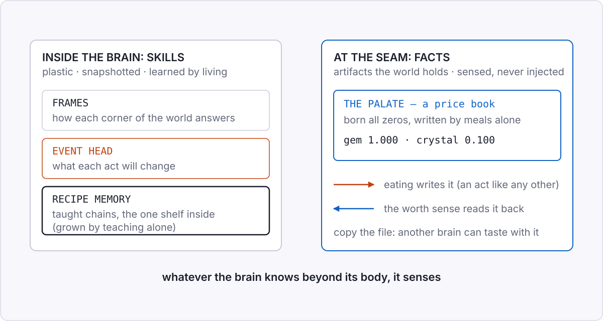

<!-- Draws on: design 0018 (brain anatomy: the zones of the learner),
     0003/0004 (sensorimotor core, structural learning), 0009 (the event
     head and the brain-side hold), 0010 (recipes and the label), 0013
     (the palate), 0016 (the motivation stack); episodes 0072 (the event
     pathway ships, 2026-08-09), 0076 (the steps, 2026-08-09), 0088
     (worth not count, 2026-08-10), 0089 (the tongue learns,
     2026-08-10). Zone names verified against src/pra (FrameStore,
     RecipeMemory, CompletionItchPolicy) on 2026-08-18. Sibling page of
     the-anatomy-of-a-body.md. -->

# Appendix — The anatomy of a brain

The body appendix drew the two lists: what comes in, what goes out.
This page opens what sits behind them. The chapters meet the brain one
part at a time (the rival guessers in chapter 6, wanting in chapter 9,
the snapshot in chapter 11, taught steps in chapter 16); here the
parts share one picture, because a question keeps arriving in
different clothes: when the brain knows something, where does that
knowledge live?

Everything inside the outline obeys two rules. Nothing in there is
ever finished: every part keeps learning for as long as the brain
runs. And nothing gets in from outside except through the senses.
There is no side door where facts are loaded into the brain the way an
app loads a database. Whatever it knows, it learned by living, and
whatever it consults, it senses.

## The parts

The **frame store** is the bulk of the brain: the population of small
rival maps from chapter 6. Each frame is one guesser. It recognizes a
slice of the world, predicts what that slice does next under each act,
and is graded on nothing else. Frames are born when an observation
fits no one and evicted when they stop earning their keep. What the
store holds is habits rather than facts: how each corner of the world
answers each poke.

The **event head** is one map more, with a different question. The
frames ask "where am I"; the head asks "what will this act change".
Chapter 14 ran on it, because wanting follows expecting and the head
is the expecting. It became brain state proper on 2026-08-09,
snapshotted and resized with everything else.

The motivation layer is not a store at all. It is the brain's posture
this moment: how strong the itch to finish is, whether a commitment is
alive, how loud a teacher's label rings, how hungry the body is and
how far that hunger may bend the vote. Yesterday's posture is gone;
only its consequences remain, in what the frames learned while it
held.

**Recipe memory** is the exception, and the reason this page exists.
When a demonstration teaches the brain a chain (chapter 16: the steps,
not the ingredients), the steps are kept in their own structure, next
to the frames rather than dissolved into them. It is the closest thing
inside the brain to a bookshelf. Knowledge you can point to, carried
as itself, grown only by teaching.

## Where knowledge lives

So the honest split: inside the brain live skills, expectations, and
one small shelf of taught steps, all plastic, all in chapter 11's
snapshot. Facts prefer to live outside.

The palate is the shipped example. What food is worth is a fact about
the world, and the brain does not store it. The body keeps a little
price book at the seam, written by nothing but meals: on 2026-08-10 a
brain whose book was born all zeros ate its way to gem 1.000 and
crystal 0.100, the world's actual prices, with nobody ever telling it
a number. The brain reads that book the only way it reads anything, as
a sense. Copy the file and a different brain can taste with it.

I like this split for an engineering reason, not a philosophical one.
A learner whose facts live in artifacts can have those facts
inspected, corrected, and handed to the next brain without touching
the thing that learned them. The frozen models of chapter 1 melt
knowledge and skill into the same weights, which is why updating one
risks the other; here the seam keeps them apart.

The same week supplied the warning that guards the rule. A brain whose
wealth sense counted items could not learn a trade that loses count
but gains worth: zero successes in twenty-four attempts. Pointing the
same sense at worth instead flipped it to twenty-four of twenty-four
(2026-08-10, both readings). Which sense defines a thing decides what
the brain can know about it. An outside store is never a free lunch:
the sense that reads it is a design decision, and consulting it well
is a skill the brain has to be taught, like any other chain.

> **Under the hood: the zones, exactly.** Verified against the running
> code and design 0018 on 2026-08-18, not copied from prose.
>
> | zone | in the code | holds | snapshotted |
> |---|---|---|---|
> | frames | `FrameStore` / `FrameGroup` | encoder, decoder, per-act transition per frame; born on demand, evicted by the survival score | yes |
> | event head | owned by `FrameStore` | one per-act observation-delta model; off by config, bit-exact | yes |
> | motivation | `CompletionItchPolicy` and its recipe subclass | the live itch, a held intention, label gain, deficit scaling | yes |
> | recipe memory | `RecipeMemory` | taught step chains and their labels | yes |
> | palate | `PALATE_FILE`, body side | learned prices, a running average of felt meals | body state: a portable file, sensed as the worth channel |
>
> The dials in the drawing (κ the itch, β the label, κ_d the deficit
> coupling, κ_c commitment) are specified in the record's design 0011;
> each defaults to the measured operating point of design 0015. The
> snapshot carries every row above except the palate, which travels as
> its own file precisely because it is not brain.
